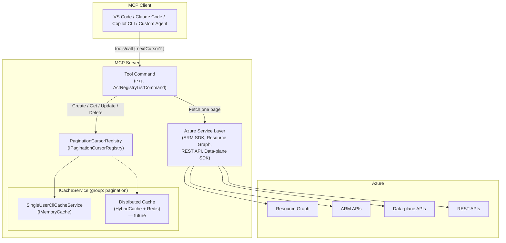
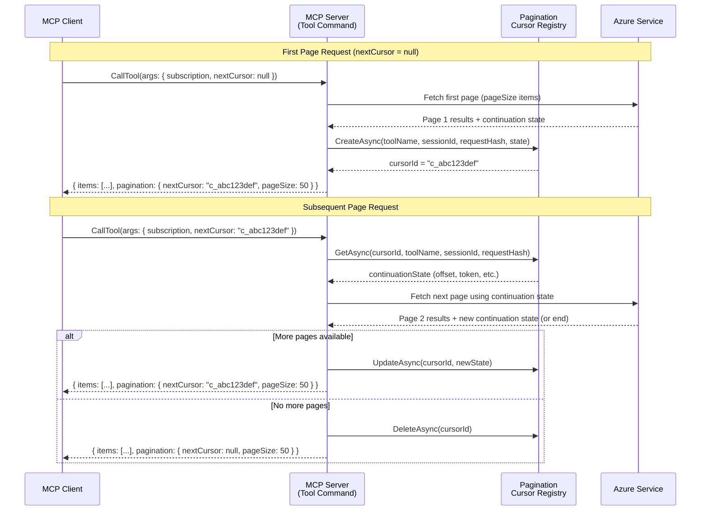
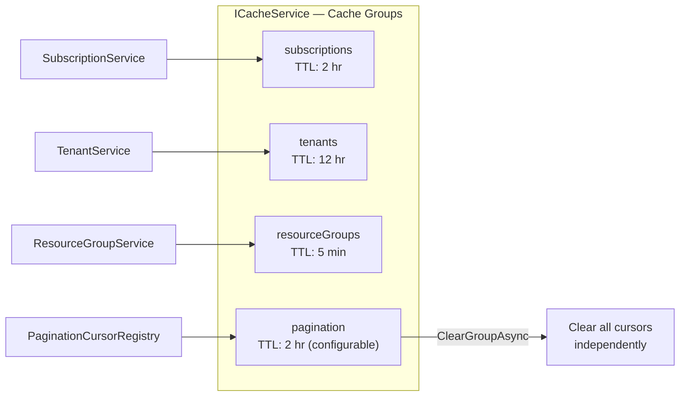

# Pagination Design Proposal for Azure MCP Tools

## Status

**Draft** — April 2026

## References

- Internal design: [`docs/design/pagination.md`](pagination.md)
- Tool inventory: [`docs/azure-mcp-list-tools.md`](../azure-mcp-list-tools.md)
- [microsoft/mcp#428 — Context window overflow from unbounded tool responses](https://github.com/microsoft/mcp/issues/428)
- [modelcontextprotocol/modelcontextprotocol#799 — Extend pagination to all tool request/response patterns](https://github.com/modelcontextprotocol/modelcontextprotocol/discussions/799)
- [Azure MCP pagination problem statement (Gist)](https://gist.github.com/xiangyan99/32bebf596ae2903e46989422dc4ea757)
- [MCP Specification — Pagination](https://modelcontextprotocol.io/specification/2025-03-26/server/utilities/pagination)
- [MCP Tool Annotations](https://modelcontextprotocol.io/docs/concepts/tools#tool-annotations)

## Table of Contents

- [Problem Statement](#problem-statement)
- [Design Goals](#design-goals)
- [High-Level Architecture](#high-level-architecture)
- [Request and Response Schema](#request-and-response-schema)
- [Cursor Lifecycle — Creation, Storage, Retrieval, and Eviction](#cursor-lifecycle--creation-storage-retrieval-and-eviction)
- [User Experience](#user-experience)
- [Authentication — Local and Remote Scenarios](#authentication--local-and-remote-scenarios)
- [Caching Strategy](#caching-strategy)
- [Error Handling](#error-handling)
- [Prior Art](#prior-art)
- [Configuration](#configuration)
- [Rollout Plan](#rollout-plan)
- [Open Questions](#open-questions)
- [Appendix: Tool Inventory — Commands Requiring Pagination](#appendix-tool-inventory--commands-requiring-pagination)

---

## Problem Statement

Azure MCP tools that return collections (list, get-as-list, query) currently consume all pages from the underlying Azure service and return the entire result set in a single tool response. This creates three compounding problems:

1. **Context window overflow.** LLM clients have hard token limits on tool responses. For example, Claude Code enforces a 25,000-token ceiling per tool call. A `subscription list` returning all subscriptions produced 44,221 tokens and was rejected outright ([microsoft/mcp#428](https://github.com/microsoft/mcp/issues/428)). This is not an edge case — any enterprise tenant with a moderate number of resources will exceed these limits for common listing operations.

2. **Latency and memory pressure.** Fetching all pages from Azure before responding means the MCP server must hold the entire result set in memory and the client must wait for all pages to complete. For services with thousands of resources (e.g., blob containers, Event Grid subscriptions, policy assignments), this causes multi-second latencies and risks out-of-memory conditions on the server.

3. **Wasted work.** In agent-driven workflows, the LLM often needs only a subset of results — enough to find a specific resource, confirm a configuration, or select from a short list. Returning 500 items when the model needs 5 is wasteful for compute, network, and token budget.

### What pagination addresses

Pagination allows the MCP server to return results in discrete, size-bounded chunks (pages). The client (or the LLM agent) can decide whether to request additional pages based on the results already received. This keeps individual responses within token limits, reduces latency for the first page, lowers memory pressure, and lets agents stop early once they have enough information.

### Why server-side cursors

Azure service backends use diverse pagination mechanisms — KQL offsets (Resource Graph), continuation tokens (ARM SDK `AsyncPageable`), `nextLink` URLs (REST APIs), `$skiptoken` (OData/Marketplace), and protocol-specific approaches (Kusto control commands, SQL queries). Exposing these details to MCP clients would leak backend implementation details and create a fragile contract. Instead, the MCP server issues opaque, server-managed cursor identifiers that abstract over all backend pagination mechanisms. Clients interact with a single, uniform pagination model regardless of which Azure service is being queried.

---

## Design Goals

1. **Uniform client experience.** Every paginated tool uses the same `nextCursor` request/response contract. Clients never need to understand Azure-specific pagination mechanisms.

2. **Backward compatible.** Existing tools continue to work without pagination. The `nextCursor` parameter is optional, and responses without `pagination` are valid.

3. **Transport agnostic.** The design works identically in stdio (CLI, local agent) and HTTP (remote, multi-user) transport modes.

4. **Safe by default.** Cursors are session-scoped, request-hash-validated, and TTL-expired. A cursor issued for one user/tool/query cannot be reused for a different user/tool/query.

5. **Progressive caching strategy.** Start with in-memory caching for the early preview (stdio-only, single-user). Add distributed caching (Redis/HybridCache) for HTTP multi-server deployments without changing the tool or client contract.

6. **Incremental rollout.** Pagination can be enabled per-tool without modifying other tools. Tools opt in by setting `SupportsPagination = true` in their metadata.

7. **LLM-friendly.** Page sizes default to a size that fits comfortably within token limits. Tool descriptions guide the LLM on when and how to request additional pages.

---

## High-Level Architecture



### Component responsibilities

| Component | Responsibility |
|---|---|
| **Tool Command** | Accepts `nextCursor`, computes request hash, calls service for one page, interacts with cursor registry |
| **PaginationCursorRegistry** | Creates, retrieves, updates, and deletes cursor entries. Validates ownership and parameter consistency. |
| **ICacheService** | Stores cursor entries with TTL. Abstraction layer that allows swapping in-memory for distributed cache. |
| **Azure Service Layer** | Fetches one page of results using backend-specific pagination (offset, continuation token, nextLink, etc.) |

---

## Request and Response Schema

### Request schema

Every paginated tool accepts an optional `nextCursor` parameter alongside its existing parameters:

```json
{
  "subscription": "my-sub",
  "resourceGroup": "my-rg",
  "nextCursor": null
}
```

- **First page:** `nextCursor` is `null`, omitted, or empty string
- **Subsequent pages:** `nextCursor` is the opaque string from the previous response

When `nextCursor` is provided, the server validates that:
1. The cursor exists and has not expired
2. The cursor was issued by the same tool
3. The cursor belongs to the same session (in HTTP mode)
4. The request parameters (excluding `nextCursor`) hash to the same value as the original request

### Response schema

```json
{
  "status": 200,
  "results": {
    "items": [
      { "name": "myregistry-prod", "location": "eastus", "sku": "Premium" },
      { "name": "myregistry-dev", "location": "westus", "sku": "Standard" }
    ],
    "pagination": {
      "nextCursor": "c_abc123def456",
      "pageSize": 50
    }
  },
  "duration": 234
}
```

| Field | Type | Description |
|---|---|---|
| `pagination.nextCursor` | `string?` | Opaque cursor for the next page. `null` when this is the last page. |
| `pagination.pageSize` | `int` | Number of items requested per page (may differ from items returned on last page). |

### Tool metadata

Paginated tools declare pagination support in their `ToolMetadata`:

```csharp
public override ToolMetadata Metadata => new()
{
    Destructive = false,
    ReadOnly = true,
    SupportsPagination = true
};
```

This is surfaced to MCP clients as a `paginationHint` annotation in the tool listing, aligning with the proposed MCP spec extension ([modelcontextprotocol#799](https://github.com/modelcontextprotocol/modelcontextprotocol/discussions/799)).

### Tool description convention

Paginated tools append the following to their description:

> Returns up to {pageSize} items per request. If `pagination.nextCursor` is non-null in the response, more results are available. To fetch the next page, call this tool again with the same parameters and the returned `nextCursor` value. Always confirm with the user before fetching additional pages.

---

## Cursor Lifecycle — Creation, Storage, Retrieval, and Eviction

```mermaid
flowchart TD
    A["Tool ExecuteAsync"] -->|Receives request| B{"nextCursor<br/>provided?"}
    B -->|No| C["Call Azure service<br/>for first page"]
    C --> D["Get results +<br/>continuation state"]
    D --> E{"More results<br/>available?"}
    E -->|Yes| F["CursorRegistry.CreateAsync<br/>stores: toolName, sessionId,<br/>requestHash, continuationState"]
    F --> G["Return results +<br/>pagination.nextCursor"]
    E -->|No| H["Return results +<br/>pagination.nextCursor = null"]

    B -->|Yes| I["CursorRegistry.GetAsync<br/>validates: toolName, sessionId,<br/>requestHash match"]
    I -->|Valid| J["Extract continuation state<br/>nextLink / offset / skip / etc."]
    J --> K["Call Azure service<br/>with continuation state"]
    K --> L["Get results +<br/>new continuation state"]
    L --> M{"More results?"}
    M -->|Yes| N["CursorRegistry.UpdateAsync<br/>new continuation state"]
    N --> G
    M -->|No| O["CursorRegistry.DeleteAsync<br/>remove cursor"]
    O --> H

    I -->|"Invalid / Expired"| P["Return 400 error:<br/>invalid or expired cursor"]
```



### Cursor creation (first page)

When a tool receives a request without `nextCursor` (or with `nextCursor = null`):

1. The tool calls the Azure service to fetch the first page of results (up to `pageSize` items).
2. If the service indicates more results are available (e.g., `AreResultsTruncated`, non-null continuation token, presence of `nextLink`), the tool creates a cursor:
   ```csharp
   var cursorId = await _cursorRegistry.CreateAsync(
       toolName: "azmcp_acr_registry_list",
       sessionId: context.SessionId,
       requestHash: ComputeRequestHash(options),
       continuationState: new Dictionary<string, string>
       {
           ["offset"] = "50"  // or continuationToken, nextLink, etc.
       },
       cancellationToken);
   ```
3. The cursor ID (e.g., `c_a1b2c3d4e5f6...`) is included in the response as `pagination.nextCursor`.

### Cursor storage

Each cursor entry is stored in the `ICacheService` under the `"pagination"` cache group with the following structure:

```csharp
public sealed class PaginationCursorEntry
{
    public required string ToolName { get; init; }
    public required string SessionId { get; init; }
    public required string RequestHash { get; init; }
    public required Dictionary<string, string> ContinuationState { get; set; }
    public DateTimeOffset CreatedAt { get; init; }
}
```

**Key design decisions:**

- **Cursor ID format:** `c_<GUID>` — opaque, reveals no internal state, not guessable.
- **Request hash:** SHA256 of the canonical request parameters (sorted, serialized, excluding `nextCursor`). This ensures that a cursor cannot be reused with different query parameters.
- **ContinuationState:** A generic `Dictionary<string, string>` that accommodates all Azure pagination backends:
  - Resource Graph: `{ "offset": "50" }`
  - ARM SDK: `{ "continuationToken": "<base64-token>" }`
  - REST API: `{ "nextLink": "https://management.azure.com/..." }`
  - Marketplace: `{ "skipToken": "<opaque-token>" }`
- **TTL:** Configurable via `PaginationOptions.CursorTimeToLive` (default: 2 hours). The cursor is set with an absolute expiration in the cache.

### Cursor retrieval (subsequent pages)

When a tool receives a request with a non-null `nextCursor`:

1. The tool computes the request hash from the current parameters (excluding `nextCursor`).
2. It calls `_cursorRegistry.GetAsync(cursorId, toolName, sessionId, requestHash)`.
3. The registry validates:
   - **Existence:** The cursor ID exists in the cache (not expired).
   - **Tool match:** The stored `ToolName` matches the requesting tool.
   - **Session match:** The stored `SessionId` matches the current session (prevents cross-user reuse in HTTP mode).
   - **Request hash match:** The stored `RequestHash` matches the computed hash (prevents parameter tampering between pages).
4. If validation passes, the `ContinuationState` is extracted and used to fetch the next page from Azure.
5. If the service returns more results, the cursor is updated in-place with the new continuation state via `_cursorRegistry.UpdateAsync()`.
6. If this is the last page, the cursor is deleted via `_cursorRegistry.DeleteAsync()`.

### Cursor eviction

Cursors are evicted in three ways:

1. **Natural TTL expiry.** The `ICacheService` automatically evicts entries after `CursorTimeToLive` (default 2 hours). This handles abandoned cursors (e.g., the user stopped paging).

2. **Explicit deletion on last page.** When a tool detects that no more results are available, it immediately deletes the cursor to free cache memory.

3. **Session cleanup.** When a session ends (e.g., stdio transport closes, HTTP session timeout), `ClearSessionAsync(sessionId)` removes all cursors for that session.

4. **Manual clear.** `ClearAllAsync()` removes all cursors across all sessions. This is an administrative operation.

### Interaction sequence diagram



---

## User Experience

### Chat mode (stdio transport)

In chat mode, the MCP server runs as a child process of the MCP client (e.g., VS Code, Claude Code, Copilot CLI). The LLM agent drives the pagination loop:

```
User: "List my container registries"

Agent: [calls azmcp acr registry list]
       → Response: 50 items, nextCursor = "c_abc123"

Agent: "Here are the first 50 container registries:
        1. myregistry-prod (eastus, Premium)
        2. myregistry-dev (westus, Standard)
        ...
        There are more results available. Would you like to see the next page?"

User: "Yes"

Agent: [calls azmcp acr registry list with nextCursor = "c_abc123"]
       → Response: 12 items, nextCursor = null

Agent: "Here are the remaining 12 container registries:
        51. myregistry-staging (centralus, Basic)
        ...
        That's all 62 container registries in your subscription."
```

**Key UX principles:**
- The agent always asks the user before fetching additional pages (guided by the tool description).
- The agent can summarize or filter results before presenting them.
- The agent can stop early if it finds the information it needs ("Which registry is in eastus?" → stop after first page if found).

### Agent mode (autonomous)

In agentic workflows (e.g., a planning agent that needs a complete inventory), the agent may choose to fetch all pages automatically:

```
Agent (internal): I need a complete list of VMs for this migration assessment.
  → Page 1: 50 VMs, nextCursor = "c_def456"
  → Page 2: 50 VMs, nextCursor = "c_ghi789"
  → Page 3: 23 VMs, nextCursor = null
  → Total: 123 VMs collected

Agent: "I found 123 VMs across your subscription. Here's the migration assessment..."
```

The tool description includes the instruction "Always confirm with the user before fetching additional pages." Whether the agent follows this depends on the MCP client's configuration and the agent's autonomy settings.

### Multi-step workflows

Cursors are valid for the configured TTL (default 2 hours), allowing the user to:
- Fetch page 1, ask follow-up questions about the results, then fetch page 2
- Switch to a different tool, come back, and continue paging
- Close and reopen the conversation within the TTL window (stdio only — the server process must remain running)

---

## Authentication — Local and Remote Scenarios

### Local (stdio) authentication

In stdio mode, the MCP server runs as a single-user process. Authentication is handled by `DefaultAzureCredential` (typically `AzureCLICredential` from `az login`). All cursors belong to the same implicit session.

**Session ID:** In stdio mode, there is no multi-user concern. The session ID can be a fixed value (e.g., `"stdio"`) or the process ID. The session ID validation in the cursor registry is still enforced for consistency but is effectively a no-op since there is only one session.

### Remote (HTTP) authentication

In HTTP mode, the MCP server runs as a shared service. Each request is authenticated via:
- **On-behalf-of (OBO):** The MCP client provides a bearer token. The server authenticates to Azure on behalf of the user via OBO flow. Each user has a distinct identity.
- **Managed identity:** The server uses its own identity. All users share the server's permissions.

**Session ID:** In HTTP mode, the session ID is derived from the authenticated user's identity (e.g., OID from the JWT claims) or the MCP session ID. This ensures:
- User A's cursors cannot be used by User B
- Cursor-bound Azure credentials match the requesting user
- Token refresh happens per-user, not per-cursor

**Important:** The Azure credentials used to fetch page N must be the same (or equivalent) credentials used to fetch page 1. For OBO scenarios, the OBO token must be refreshable for the cursor's lifetime. If the token expires and cannot be refreshed, the cursor becomes unusable and the client must start a new pagination sequence.

### Credential caching interaction

The existing `ICacheService` already caches `AuthenticatedClient` instances (TTL: 15 minutes) and tenant/subscription data. Pagination cursors use the same `ICacheService` but in an isolated cache group (`"pagination"`). There is no cross-contamination between credential cache entries and pagination cache entries.

---

## Caching Strategy

### Why caching is needed

Pagination cursors are inherently stateful — they map an opaque cursor ID to backend-specific continuation state (offsets, tokens, URLs). This state must persist between requests because:

1. **Azure services are stateless.** Azure Resource Graph doesn't maintain server-side cursors — the client must re-issue the query with an offset. ARM SDK continuation tokens are opaque blobs that must be passed back verbatim. REST API `nextLink` URLs contain all query state.

2. **MCP protocol is request/response.** Each `tools/call` is an independent request. There is no persistent connection or stream between pages. The cursor registry bridges this gap.

3. **Multi-user isolation.** In HTTP mode, cursor state must be partitioned by user and validated on each access.

### Phase 1 — In-memory cache (early preview)

For the initial preview release targeting stdio (single-user, single-process) scenarios:

- **Implementation:** `SingleUserCliCacheService` backed by `IMemoryCache`
- **Lifetime:** Singleton, process-scoped
- **TTL:** 2 hours (configurable via `PaginationOptions.CursorTimeToLive`)
- **Capacity:** Unbounded (practical limit: a few hundred cursors at most in CLI usage)
- **Pros:** Zero infrastructure, zero latency, works out of the box
- **Cons:** Lost on server restart, single-process only, not suitable for multi-server HTTP deployments

This is the existing implementation and requires no changes to the caching layer.

### Phase 2 — Distributed cache (HTTP multi-server)

For production HTTP deployments with multiple server instances behind a load balancer:

- **Implementation:** Replace `ICacheService` with a distributed implementation backed by Redis or `HybridCache`
- **HybridCache advantages:** The codebase already uses `HybridCache` in `HybridCacheSessionStore` for session affinity in the `Microsoft.ModelContextProtocol.HttpServer.Distributed` package. This provides:
  - L1 (in-memory) + L2 (Redis/SQL) two-tier caching
  - Built-in stampede protection
  - Automatic serialization/deserialization
  - Tag-based invalidation
- **Migration path:** Since all pagination code depends on `ICacheService` (not on `IMemoryCache` directly), swapping the implementation is a DI registration change — no tool code changes required.

```csharp
// Phase 1: stdio mode
services.AddSingleUserCliCacheService(); // IMemoryCache-backed

// Phase 2: HTTP mode with Redis
services.AddSingleton<ICacheService, HybridCacheService>(); // Redis-backed
```

### Cache isolation



The pagination cache group (`"pagination"`) is fully isolated from other cache groups:

| Cache group | Owner | TTL | Purpose |
|---|---|---|---|
| `subscriptions` | `SubscriptionService` | 2 hours | Subscription metadata |
| `tenants` | `TenantService` | 12 hours | Tenant metadata |
| `resourceGroups` | `ResourceGroupService` | 5 minutes | Resource group lists |
| `pagination` | `PaginationCursorRegistry` | 2 hours (configurable) | Pagination cursors |

Calling `ClearGroupAsync("pagination")` removes all cursors without affecting subscription, tenant, or resource group caches.

### Note on `HttpServiceCacheService`

The current `HttpServiceCacheService` is a no-op stub — all methods return defaults. This was intentionally left unimplemented pending design decisions around per-user vs. per-request caching and Entra Conditional Access implications. **Pagination in HTTP mode requires this stub to be replaced with a real implementation** (Phase 2). Until then, pagination in HTTP mode will not persist cursors between requests, effectively falling back to single-page responses.

---

## Error Handling

### Expired or evicted cursor

When a cursor has been evicted (TTL expired, server restarted, manual clear):

```json
{
  "status": 400,
  "error": {
    "code": "InvalidCursor",
    "message": "The pagination cursor has expired or is invalid. Please restart the listing operation without a cursor to begin from the first page."
  }
}
```

The MCP specification recommends JSON-RPC error code `-32602` (Invalid params) for invalid cursors. The tool surfaces this as a 400-level error with a clear message guiding the client to restart.

### Cursor-tool mismatch

When a cursor issued by tool A is used with tool B:

```json
{
  "status": 400,
  "error": {
    "code": "InvalidCursor",
    "message": "The pagination cursor was not issued by this tool. Each cursor is bound to the tool that created it."
  }
}
```

### Request parameter mismatch

When the request parameters (excluding `nextCursor`) differ from the original request:

```json
{
  "status": 400,
  "error": {
    "code": "InvalidCursor",
    "message": "The request parameters have changed since the cursor was created. Please restart the listing operation without a cursor."
  }
}
```

This prevents attacks or mistakes where a user modifies filter parameters mid-pagination, which could produce inconsistent results.

### Session mismatch (HTTP mode)

When user B attempts to use a cursor created by user A:

```json
{
  "status": 403,
  "error": {
    "code": "CursorAccessDenied",
    "message": "This pagination cursor belongs to a different session."
  }
}
```

### Agent recovery guidance

Tool descriptions include recovery instructions for the LLM:

> If you receive an "InvalidCursor" error, discard the cursor and call the tool again without `nextCursor` to restart from the first page.

This ensures agents can recover gracefully without user intervention.

---

## Prior Art

### GitHub MCP Server

The [GitHub MCP Server](https://github.com/github/github-mcp-server) uses two pagination approaches depending on the backend API:

**REST API tools (page/perPage):** Tools like `list_issues` (REST), `get_comments`, and `get_sub_issues` accept explicit `page` and `perPage` parameters. The client manages page numbers and can jump to arbitrary pages. This is a **stateless, offset-based** approach where the server does not maintain any cursor state.

```json
{
  "owner": "microsoft",
  "repo": "mcp",
  "page": 2,
  "perPage": 30
}
```

**GraphQL tools (cursor-based):** Tools like `list_issues` (GraphQL) use cursor-based pagination with an `after` parameter and return `pageInfo.endCursor` and `pageInfo.hasNextPage`. The cursor is a GitHub-provided opaque token (typically a base64-encoded node ID).

```json
{
  "owner": "microsoft",
  "repo": "mcp",
  "after": "Y3Vyc29yOnYyOpK5MjAyNS0wMS0xNVQxMDowMDowMCswMDowMM4..."
}
```

**Key differences from Azure MCP's approach:**
- GitHub cursors are **service-provided** (GitHub's API returns them). Azure MCP cursors are **server-generated** because Azure backends use diverse, incompatible pagination mechanisms.
- GitHub MCP does not maintain server-side cursor state. Azure MCP must maintain state because Azure continuation tokens are often large, security-sensitive, or not suitable for client exposure.
- GitHub MCP exposes `page`/`perPage` directly. Azure MCP abstracts this behind opaque cursors to avoid leaking backend details.

### RubyMine Rails MCP

JetBrains' [RubyMine MCP tools](https://blog.jetbrains.com/ruby/2026/02/rubymine-mcp-and-the-rails-toolset/) use **offset-based pagination with a cache key** for their Rails toolset:

```json
{
  "summary": {
    "page": 1,
    "item_count": 10,
    "total_pages": 13,
    "total_items": 125,
    "cache_key": "abc123"
  },
  "items": [ ... ]
}
```

**Key design choices:**
- **Offset-based pagination** (`page`, `page_size` parameters) because RubyMine operates on a snapshot of the project state from the IDE's cache — the data is static and fully known at request time.
- **Cache key for consistency detection.** If the IDE's analysis cache is recalculated between page fetches (e.g., due to a code change), the `cache_key` changes. The LLM can detect the mismatch and re-fetch previous pages.
- **Rich pagination metadata.** Includes `total_pages` and `total_items`, enabling the LLM to estimate scope and decide whether to fetch all pages.

**Why Azure MCP uses cursor-based instead:**
- Azure data is **not static** — resources can be created/deleted between page fetches. Offset-based pagination risks skipping or duplicating items.
- Azure backends don't expose total counts cheaply. Resource Graph queries don't return a total count, and ARM SDK `AsyncPageable` is a streaming abstraction without a count.
- Cursor-based pagination aligns with the [MCP specification's recommendation](https://modelcontextprotocol.io/specification/2025-03-26/server/utilities/pagination) for opaque cursors.

### MCP Specification

The [MCP specification](https://modelcontextprotocol.io/specification/2025-03-26/server/utilities/pagination) defines pagination for `resources/list`, `prompts/list`, `tools/list`, and `resources/templates/list` operations using opaque cursors. The [proposed extension](https://github.com/modelcontextprotocol/modelcontextprotocol/discussions/799) aims to bring this same pattern to `tools/call` responses via a `paginationHint` annotation and a `pagination` block in the response.

Azure MCP's design follows the proposed extension:
- `paginationHint: true` in tool annotations → `SupportsPagination = true` in `ToolMetadata`
- `pagination.nextCursor` in response → `PaginationInfo.NextCursor`
- Error code `-32602` for invalid cursors → `InvalidCursor` error response

---

## Configuration

| Setting | Default | Source | Description |
|---|---|---|---|
| `Pagination:DefaultPageSize` | 50 | `appsettings.json` / env var | Items per page when the tool doesn't specify its own |
| `Pagination:CursorTimeToLive` | `02:00:00` (2 hours) | `appsettings.json` / env var | How long a cursor remains valid |

Individual tools may override `DefaultPageSize` based on the expected response size. For example, tools returning complex objects (e.g., policy assignments with large JSON bodies) might use a smaller page size (e.g., 10) to stay within token limits.

---

## Rollout Plan

### Phase 1 — Foundation (current)

- [x] `ICacheService` abstraction with `SingleUserCliCacheService` (in-memory)
- [x] `IPaginationCursorRegistry` interface and `PaginationCursorRegistry` implementation
- [x] `PaginationCursorEntry` and `PaginationInfo` models
- [x] `PaginationOptions` configuration
- [ ] Integration with tool command base classes
- [ ] First paginated tool (e.g., `acr registry list` as reference implementation)

### Phase 2 — Expand coverage

- [ ] Enable pagination for all 12 Resource Graph commands (simplest — offset-based)
- [ ] Enable pagination for high-impact ARM SDK commands (`subscription list`, `group list`, `group resource list`)
- [ ] Add `nextCursor` option to the common option definitions

### Phase 3 — HTTP mode support

- [ ] Implement distributed `ICacheService` backed by `HybridCache` + Redis
- [ ] Integrate session ID from HTTP authentication context
- [ ] Replace `HttpServiceCacheService` no-op stub
- [ ] Validate cursor security in multi-user scenarios

### Phase 4 — Full coverage

- [ ] Enable pagination for remaining ARM SDK commands
- [ ] Enable pagination for data-plane SDK commands
- [ ] Enable pagination for REST API commands
- [ ] Evaluate pagination for service-specific protocol commands (Kusto, MySQL, Postgres)

---

## Open Questions

1. **Page size tuning.** Should page size be token-aware (estimate tokens per item and adjust page size dynamically) or fixed? Token estimation adds complexity but prevents the "50 items that happen to be very large" problem.

2. **Cursor in `_meta` vs inline.** The MCP spec discussion suggests `pagination` in the result block. Should Azure MCP also/instead use the `_meta` field on `CallToolResult` for `nextCursor`?

3. **`HttpServiceCacheService` design.** What caching semantics are appropriate for multi-user HTTP mode? Per-request only (no cross-request caching), per-user (shared across requests by the same user), or global (shared across all users)?

4. **Forward-only vs. bidirectional.** The current design is forward-only (no `previousCursor`). Should bidirectional pagination be supported? This would require storing additional state and is uncommon in MCP implementations.

5. **Cursor serialization for AOT.** `PaginationCursorEntry` must be registered in a `JsonSerializerContext` for AOT compatibility if it's ever serialized to a distributed cache.

---

## Appendix: Tool Inventory — Commands Requiring Pagination

The following inventory catalogs all 80 Azure MCP tools that return collections, organized by the backend pagination mechanism they use. This determines the continuation state each tool must store in the cursor registry.

### Azure Resource Graph (12 commands)

These use `BaseAzureResourceService.ExecuteResourceQueryAsync()` with a KQL `| limit N` clause. The service returns an `AreResultsTruncated` flag but no built-in continuation token. Pagination requires storing the current `offset` and re-issuing the query with `| limit N | offset M`.

| Command | Current limit |
|---|---|
| `acr registry list` | 50 |
| `advisor recommendation list` | 50 |
| `appconfig account list` | 50 |
| `containerapps list` | 50 |
| `deviceregistry namespace list` | 50 |
| `grafana list` | 50 |
| `kusto cluster list` | 50 |
| `role assignment list` | 50 |
| `sql elastic-pool list` | 50 |
| `storage account get` | 50 |
| `sql db get` | 50 |
| `workbooks list` | 50 (default), 1000 max |

**Continuation state:** `{ "offset": "50" }`

### Azure Resource Manager SDK (44 commands)

These use ARM SDK methods (`GetAllAsync()`, various `GetXxxAsync()`) that return `AsyncPageable<T>` or `IAsyncEnumerable<T>`. Currently, all pages are fully consumed with no MCP-layer limit.

Representative commands include:

- **Core platform:** `subscription list`, `group list`, `group resource list`, `policy assignment list`
- **Compute & hosting:** `aks cluster get`, `aks nodepool get`, `appservice webapp get`, `compute disk/vm/vmss get`, `functionapp get`, `servicefabric managedcluster node get`, `virtualdesktop hostpool list/host list/host user-list`
- **Storage:** `fileshares fileshare/snapshot/privateendpointconnection get`, `storagesync service/syncgroup/serverendpoint/registeredserver/cloudendpoint get`, `managedlustre fs list/importjob/autoexportjob/autoimportjob/sku get`
- **Databases:** `cosmos list`, `mysql list` (servers), `postgres list` (servers), `redis list`, `sql server get`, `sql server entra-admin list`, `sql server firewall-rule list`
- **Monitoring:** `applicationinsights recommendation list`, `loadtesting testresource list`, `monitor table/type list`, `monitor webtest get`, `monitor workspace list`
- **Messaging:** `eventgrid subscription/topic list`, `eventhubs consumergroup/eventhub/namespace get`, `signalr runtime get`
- **AI & search:** `foundryextensions openai models-list`, `search service list`
- **Other:** `datadog monitoredresources list`

**Continuation state:** `{ "continuationToken": "<SDK-provided-token>" }` via `AsPages()` enumeration.

### Data-plane SDK (12 commands)

These call Azure service data-plane APIs through typed SDKs. Pagination is SDK-internal.

| Command | SDK |
|---|---|
| `acr registry repository list` | `ContainerRegistryClient` |
| `appconfig keyvalue get` | App Configuration SDK |
| `storage blob get` | Blob Storage SDK |
| `storage blob container get` | Blob Storage SDK |
| `storage table list` | `TableServiceClient` |
| `keyvault certificate get` | Key Vault SDK |
| `keyvault key get` | Key Vault SDK |
| `keyvault secret get` | Key Vault SDK |
| `search index get` | AI Search SDK |
| `search knowledgebase get` | AI Search SDK |
| `search knowledgesource get` | AI Search SDK |
| `foundryextensions knowledge index list` | Foundry SDK |

**Continuation state:** `{ "continuationToken": "<SDK-specific-token>" }` (varies by SDK)

### REST API (8 commands)

These make direct HTTP calls. Pagination varies by endpoint.

| Command | Pagination mechanism |
|---|---|
| `monitor activitylog list` | `nextLink` URL |
| `appservice webapp diagnostic list` | Direct HTTP (planned SDK migration) |
| `marketplace product list` | `$skiptoken` |
| `pricing get` | API pagination |
| `quota region availability list` | Computed, no pagination |
| `resourcehealth availability-status get` | REST API pagination |
| `resourcehealth health-events list` | OData `nextLink` |
| `loadtesting testrun get` | SDK enumeration |

**Continuation state:** `{ "nextLink": "https://..." }` or `{ "skipToken": "..." }`

### Service-specific protocol (3 commands)

| Command | Protocol | Notes |
|---|---|---|
| `kusto database list` | Kusto `.show` command | Full result set, no pagination |
| `kusto table list` | Kusto `.show` command | Full result set, no pagination |
| `mysql database/table list` | SQL query | 10,000 hardcoded limit |
| `postgres database/table list` | SQL query | No explicit limit |

These commands typically return small result sets and may not require pagination initially. They can be excluded from Phase 1.

### Static/computed (1 command)

| Command | Notes |
|---|---|
| `functions language list` | Static manifest, no pagination needed |
