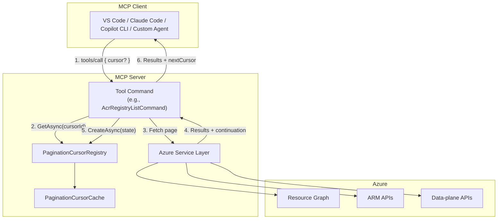
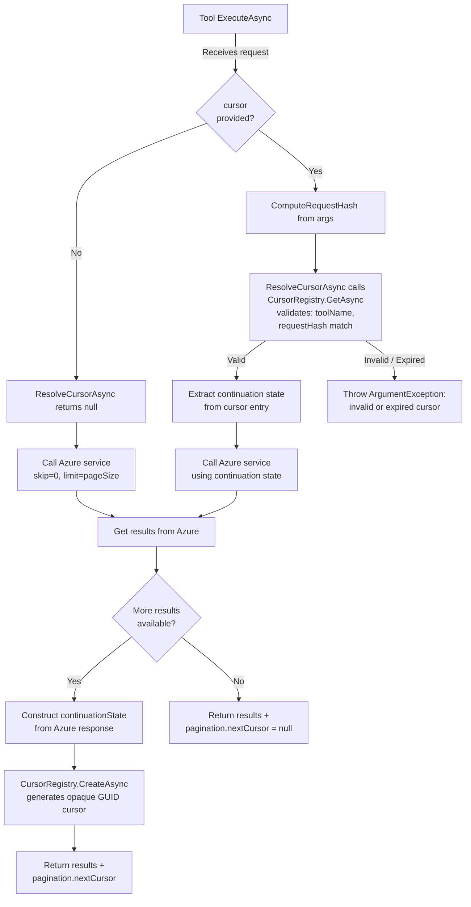
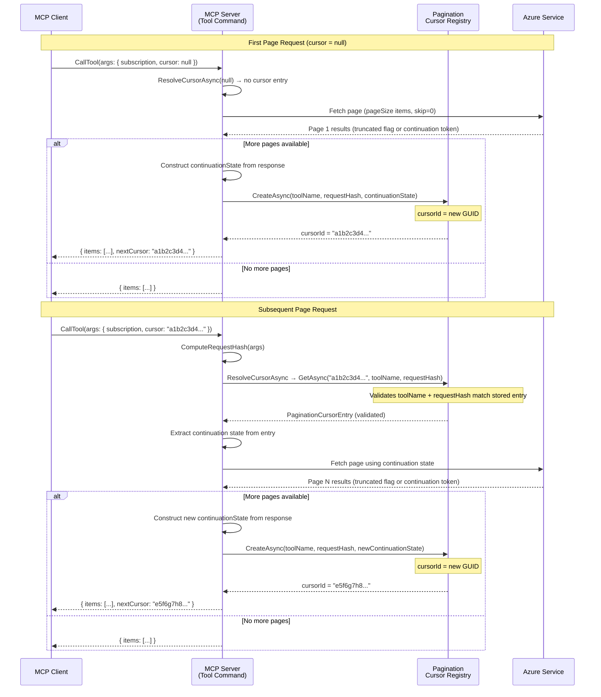
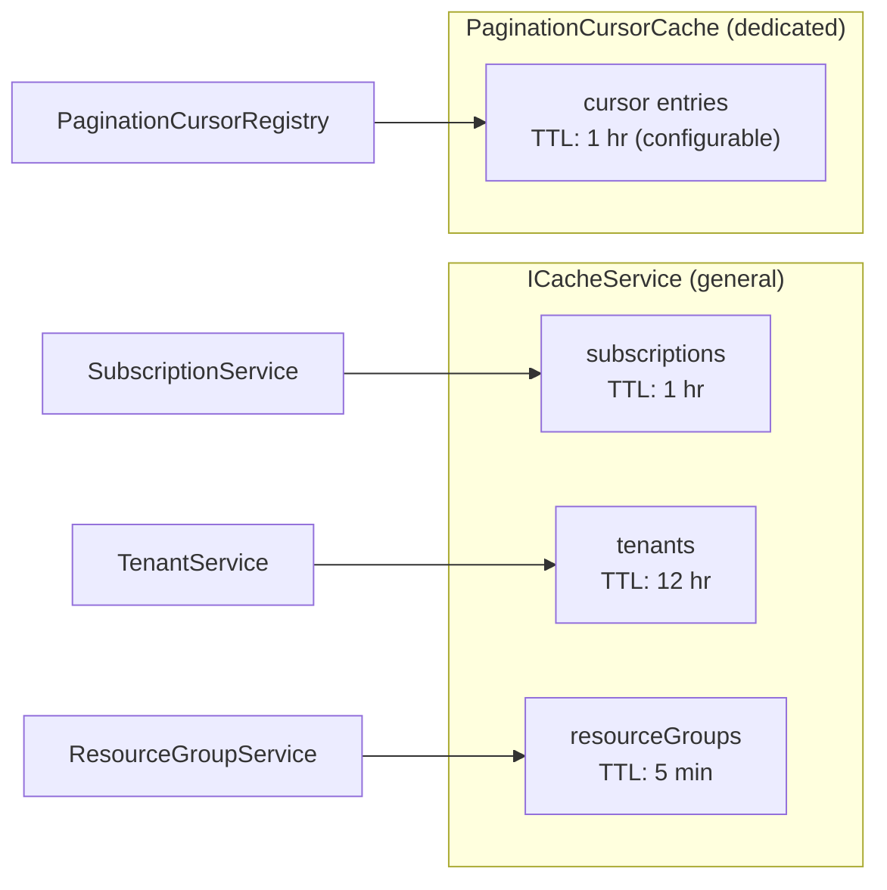

# Pagination Design Proposal for Azure MCP Tools

## Table of Contents

- [Problem Statement](#problem-statement)
- [Design Goals](#design-goals)
- [High-Level Architecture](#high-level-architecture)
- [Request and Response Schema](#request-and-response-schema)
- [Cursor Lifecycle — Creation, Storage, Retrieval, and Eviction](#cursor-lifecycle--creation-storage-retrieval-and-eviction)
- [User Experience](#user-experience)
- [Authentication — Local and Remote Scenarios](#authentication--local-and-remote-scenarios)
- [Caching Strategy](#caching-strategy)
- [Error Handling](#error-handling)
- [Prior Art](#prior-art)
- [Configuration](#configuration)
- [Open Questions](#open-questions)
- [References](#references)
- [Appendix: Tool Inventory — Commands Requiring Pagination](#appendix-tool-inventory--commands-requiring-pagination)

---

## Problem Statement

Azure MCP tools that return collections (list, get-as-list, query) either consume all pages from the underlying Azure service and return the entire result set in a single tool response, or cap results at a fixed limit with no mechanism for the client to retrieve the remaining items. Both behaviors are problematic:

1. **Context window overflow.** LLM clients have hard token limits on tool responses. For example, Claude Code enforces a 25,000-token ceiling per tool call. A `subscription list` returning all subscriptions produced 44,221 tokens and was rejected outright ([microsoft/mcp#428](https://github.com/microsoft/mcp/issues/428)). This is not an edge case — any enterprise tenant with a moderate number of resources will exceed these limits for common listing operations.

2. **Latency and memory pressure.** Fetching all pages from Azure before responding means the MCP server must hold the entire result set in memory and the client must wait for all pages to complete. For services with thousands of resources (e.g., blob containers, Event Grid subscriptions, policy assignments), this causes multi-second latencies and risks out-of-memory conditions on the server.

3. **Wasted work.** In agent-driven workflows, the LLM often needs only a subset of results — enough to find a specific resource, confirm a configuration, or select from a short list. Returning 500 items when the model needs 5 is wasteful for compute, network, and token budget.

4. **No protocol-level pagination for tool calls.** The [MCP specification defines pagination](https://modelcontextprotocol.io/specification/2025-11-25/server/utilities/pagination) using an opaque cursor-based approach, but only for a limited set of list operations — `resources/list`, `resources/templates/list`, `prompts/list`, and `tools/list`. These are metadata-listing methods that enumerate what the server exposes, not the results of invoking a tool. Critically, the specification does **not** define any pagination mechanism for `tools/call` — the method used to execute Azure service queries. This means there is no built-in protocol support for paginating the actual data returned by tool invocations. Any pagination for tool call results must be implemented as an application-level convention on top of the MCP protocol, which is what this design proposes.

### What pagination addresses

Pagination allows the MCP server to return results in discrete, size-bounded chunks (pages). The client (or the LLM agent) can decide whether to request additional pages based on the results already received. This keeps individual responses within token limits, reduces latency for the first page, lowers memory pressure, and lets agents stop early once they have enough information.

### Why server-side cursors

Azure service backends use diverse pagination mechanisms — KQL offsets (Resource Graph), continuation tokens (ARM SDK `AsyncPageable`), `nextLink` URLs (REST APIs), `$skiptoken` (OData/Marketplace), and protocol-specific approaches (Kusto control commands, SQL queries). Exposing these details to MCP clients would leak backend implementation details and create a fragile contract. Instead, the MCP server issues opaque, server-managed cursor identifiers that abstract over all backend pagination mechanisms. Clients interact with a single, uniform pagination model regardless of which Azure service is being queried.

---

## Design Goals

1. **Uniform client experience.** Every paginated tool uses the same `cursor`/`nextCursor` request/response contract. Clients never need to understand Azure-specific pagination mechanisms.

2. **Backward compatible.** Existing tools continue to work without pagination. The `cursor` parameter is optional, and responses without `pagination` are valid.

3. **Transport agnostic.** The design works identically in stdio (CLI, local agent) and HTTP (remote, multi-user) transport modes.

4. **Safe by default.** Cursors are request-hash-validated, and TTL-expired. A cursor issued for one tool/query cannot be reused for a different tool/query.

5. **Dedicated in-memory cache.** Pagination cursors are stored in a purpose-built `PaginationCursorCache` with absolute TTL expiration. This cache is completely independent of other caching concerns (e.g., subscription/tenant caching).

6. **Incremental rollout.** Pagination can be enabled per-tool without modifying other tools. Tools opt in by setting `SupportsPagination = true` in their metadata.

7. **LLM-friendly.** Page sizes default to a size that fits comfortably within token limits. Tool descriptions guide the LLM on when and how to request additional pages.

---

## High-Level Architecture



### Component responsibilities

| Component | Responsibility |
|---|---|
| **Tool Command** | Accepts `cursor`, computes request hash, resolves cursor via registry, calls service for one page, stores new cursor if more pages exist |
| **PaginationCursorRegistry** | Creates and retrieves cursor entries (opaque GUID IDs). On retrieval, validates tool name and request-hash consistency. |
| **PaginationCursorCache** | Dedicated in-memory store for pagination cursor entries. Uses `ConcurrentDictionary` with absolute TTL expiration. |
| **Azure Service Layer** | Fetches one page of results using backend-specific pagination (offset, continuation token, nextLink, etc.) |

---

## Request and Response Schema

### Request schema

Every paginated tool accepts an optional `cursor` parameter alongside its existing parameters:

```json
{
  "subscription": "my-sub",
  "resourceGroup": "my-rg",
  "cursor": null
}
```

- **First page:** `cursor` is `null`, omitted, or empty string
- **Subsequent pages:** `cursor` is the opaque string from the previous response's `pagination.nextCursor`

When `cursor` is provided, the server validates that:
1. The cursor exists and has not expired
2. The cursor was issued by the same tool
3. The request parameters (excluding `cursor`) hash to the same value as the original request

### Response schema

The tool result includes a `nextCursor` field at the top level alongside the items, following the [MCP pagination specification](https://modelcontextprotocol.io/specification/2025-03-26/server/utilities/pagination):

```json
{
  "status": 200,
  "results": {
    "items": [
      { "name": "myregistry-prod", "location": "eastus", "sku": "Premium" },
      { "name": "myregistry-dev", "location": "westus", "sku": "Standard" }
    ],
    "nextCursor": "c_abc123def456"
  },
  "duration": 234
}
```

| Field | Type | Description |
|---|---|---|
| `nextCursor` | `string?` | Opaque cursor for the next page. Omitted when this is the last page. |

### Tool metadata

Paginated tools declare pagination support in their `ToolMetadata`:

```csharp
public override ToolMetadata Metadata => new()
{
    Destructive = false,
    ReadOnly = true,
    SupportsPagination = true
};
```

This is surfaced to MCP clients as a `paginationHint` annotation in the tool listing, aligning with the proposed MCP spec extension ([modelcontextprotocol#799](https://github.com/modelcontextprotocol/modelcontextprotocol/discussions/799)).

### Tool description convention

Paginated tools append the following to their description:

> Returns up to {pageSize} items per request. If `nextCursor` is non-null in the response, more results are available. To fetch the next page, call this tool again with the same parameters and pass the returned `nextCursor` value as the `cursor` parameter. Always confirm with the user before fetching additional pages.


### Server-level pagination instructions

The MCP server includes a pagination instruction in `azure-rules.txt` (sent to MCP clients as server-level
instructions):

> **Pagination:** Some tools return paginated results. When a tool response includes a `pagination` object with a
> non-null `nextCursor` value, inform the user that more results are available and ask whether they would like to
> fetch the next page before proceeding. To retrieve the next page, call the same tool with identical parameters
> and include the `nextCursor` value as the `cursor` parameter.

This instruction is delivered to MCP clients during session initialization, ensuring that all connected agents
understand how to handle paginated responses without relying solely on per-tool descriptions.

---


## Cursor Lifecycle — Creation, Storage, Retrieval, and Eviction



### Cursor creation (first page)

When a tool receives a request without `cursor` (or with `cursor = null`):

1. The tool calls the Azure service to fetch the first page of results (up to `pageSize` items).
2. If the service indicates more results are available (e.g., `AreResultsTruncated`, non-null continuation token, presence of `nextLink`), the tool creates a cursor:
   ```csharp
   var cursorId = await _cursorRegistry.CreateAsync(
       toolName: "azmcp_acr_registry_list",
       requestHash: ComputeRequestHash(options),
       continuationState: new ContinuationState { Offset = "50" },
       cancellationToken);
   ```
3. The cursor ID (an opaque GUID like `a1b2c3d4e5f6...`) is included in the response as `pagination.nextCursor`.

### Cursor storage

Each cursor entry is stored in the `PaginationCursorCache` with the following structure:

```csharp
public sealed class PaginationCursorEntry
{
    public required string ToolName { get; init; }
    public required string RequestHash { get; init; }
    public required ContinuationState ContinuationState { get; set; }
    public DateTimeOffset CreatedAt { get; init; }
}
```

The `ContinuationState` is a strongly-typed record that restricts the allowed continuation types to prevent
arbitrary data from being stored in cursor entries:

```csharp
public sealed class ContinuationState
{
    public string? ContinuationToken { get; init; }  // ARM SDK (AsyncPageable)
    public string? Offset { get; init; }              // Resource Graph (KQL offset)
    public string? SkipToken { get; init; }           // OData/Marketplace ($skiptoken)
    public string? NextLink { get; init; }            // REST API (nextLink URL)
}
```

Exactly one property is set per cursor entry, corresponding to the pagination mechanism of the underlying Azure
service. This design ensures that only known, well-defined continuation values can be stored — preventing
security risks from arbitrary data being placed in the cursor cache (e.g., cross-user data leakage).

**Key design decisions:**

- **Cursor ID format:** Opaque GUID (`Guid.NewGuid().ToString("N")`) — reveals no internal state and is not guessable.
- **Request hash validation:** SHA256 of the canonical request parameters (sorted, serialized, excluding `cursor`). Stored alongside the cursor and validated on retrieval to ensure a cursor cannot be reused with different query parameters.
- **ContinuationState:** A closed, strongly-typed model (not an open dictionary). Only four known continuation types are allowed:
  - Resource Graph: `new ContinuationState { Offset = "50" }`
  - ARM SDK: `new ContinuationState { ContinuationToken = "<base64-token>" }`
  - REST API: `new ContinuationState { NextLink = "https://management.azure.com/..." }`
  - Marketplace: `new ContinuationState { SkipToken = "<opaque-token>" }`
- **TTL:** Configurable via `PaginationOptions.CursorTimeToLive` (default: 1 hour). The cursor is set with an absolute expiration in the cache.

### Cursor retrieval and validation

When a client presents a `cursor`, the registry retrieves the entry and validates:

1. **Existence and TTL** — the cursor must exist in the cache and not be expired.
2. **Tool name match** — the cursor must have been created by the same tool.
3. **Request hash match** — the request parameters (excluding `cursor`) must hash to the same value as when the cursor was created. This prevents reusing a cursor from one query with different parameters.

If any validation fails, the cursor is rejected and the client receives an error.

Each page in a listing gets its own unique cursor ID because each `CreateAsync` call generates a new GUID. The previous page's cursor remains in the cache until TTL expiry, preserving the continuation state it points to.

### Cursor retrieval (subsequent pages)

When a tool receives a request with a non-null `cursor`:

1. The tool computes the request hash from the current parameters (excluding `cursor`).
2. It calls `_cursorRegistry.GetAsync(cursorId, toolName, requestHash)`.
3. The registry validates:
   - **Existence:** The cursor ID exists in the cache (not expired).
   - **Tool match:** The stored `ToolName` matches the requesting tool.
   - **Request hash match:** The stored `RequestHash` matches the computed hash (prevents parameter tampering between pages).
4. If validation passes, the `ContinuationState` is extracted and used to fetch the next page from Azure.
5. If the service returns more results, a new cursor is created via `_cursorRegistry.CreateAsync()` with the new continuation state.
6. If this is the last page, no cursor is created and the response includes `nextCursor: null`. The consumed cursor remains in cache until TTL expiry.

### Cursor eviction

Cursors are evicted in two ways:

1. **Natural TTL expiry.** The `PaginationCursorCache` automatically evicts entries after `CursorTimeToLive` (default 1 hour). This handles abandoned cursors (e.g., the user stopped paging) and consumed cursors that are no longer needed for retries.

2. **Manual clear.** `ClearAllAsync()` removes all cursors. This is an administrative operation.

> **Note:** Cursors are **not** explicitly deleted when the last page is reached. This is intentional — the consumed cursor must remain available for client-side retries. All cleanup relies on TTL expiry or manual cleanup.

### Interaction sequence diagram



---

## User Experience

### Chat mode 

In chat mode, the MCP server runs as a child process of the MCP client (e.g., VS Code, Claude Code, Copilot CLI). The LLM agent drives the pagination loop:

```
User: "List my container registries"

Agent: [calls azmcp acr registry list]
       → Response: 50 items, nextCursor = "c_abc123"

Agent: "Here are the first 50 container registries:
        1. myregistry-prod (eastus, Premium)
        2. myregistry-dev (westus, Standard)
        ...
        There are more results available. Would you like to see the next page?"

User: "Yes"

Agent: [calls azmcp acr registry list with cursor = "c_abc123"]
       → Response: 12 items, nextCursor = null

Agent: "Here are the remaining 12 container registries:
        51. myregistry-staging (centralus, Basic)
        ...
        That's all 62 container registries in your subscription."
```

**Key UX principles:**
- The agent always asks the user before fetching additional pages (guided by the tool description).
- The agent can summarize or filter results before presenting them.
- The agent can stop early if it finds the information it needs ("Which registry is in eastus?" → stop after first page if found).

### Agent mode (autonomous)

In agentic workflows (e.g., a planning agent that needs a complete inventory), the agent may choose to fetch all pages automatically:

```
Agent (internal): I need a complete list of VMs for this migration assessment.
  → Page 1: 50 VMs, nextCursor = "c_def456"
  → Page 2: 50 VMs, nextCursor = "c_ghi789"
  → Page 3: 23 VMs, nextCursor = null
  → Total: 123 VMs collected

Agent: "I found 123 VMs across your subscription. Here's the migration assessment..."
```

The tool description includes the instruction "Always confirm with the user before fetching additional pages." Whether the agent follows this depends on the MCP client's configuration and the agent's autonomy settings.

### Multi-step workflows

Cursors are valid for the configured TTL (default 1 hour), allowing the user to:
- Fetch page 1, ask follow-up questions about the results, then fetch page 2
- Switch to a different tool, come back, and continue paging
- Close and reopen the conversation within the TTL window (stdio only — the server process must remain running)

### CLI mode (direct execution)

When commands are run directly from the command line (e.g., `azmcp.exe acr registry list`), the process exits
after the command completes and all in-memory state — including the `PaginationCursorCache` — is destroyed. This
makes cursor-based pagination fundamentally unusable in direct CLI mode.

To handle this, pagination is **disabled** in CLI mode via the `PaginationOptions.Enabled` property:

- `Enabled` defaults to `false`.
- When the MCP server starts (stdio or HTTP transport), `AddAzureMcpServer()` calls
  `PostConfigure<PaginationOptions>` to set `Enabled = true`.
- In direct CLI mode, `AddAzureMcpServer()` is never called, so `Enabled` remains `false`.

When pagination is disabled:
- Commands call the original (non-paged) service methods and return all available results.
- The `--cursor` option is still registered (it is part of the command schema) but is not processed.
- The response **omits** the `pagination` object entirely (the `PaginationInfo` field is serialized as `null`
  and excluded via `JsonIgnoreCondition.WhenWritingNull`).

This ensures a clean CLI experience — users see all results without pagination metadata that they cannot act on.
For paginated access, users should run the MCP server in stdio or HTTP mode.


---

## Caching Strategy

### Why caching is needed

Pagination cursors are inherently stateful — they map an opaque cursor ID to backend-specific continuation state (offsets, tokens, URLs). This state must persist between requests because:

1. **Azure services are stateless.** Azure Resource Graph doesn't maintain server-side cursors — the client must re-issue the query with an offset. ARM SDK continuation tokens are opaque blobs that must be passed back verbatim. REST API `nextLink` URLs contain all query state.

2. **MCP protocol is request/response.** Each `tools/call` is an independent request. There is no persistent connection or stream between pages. The cursor registry bridges this gap.

3. **Tool-specific continuation state varies widely.** Without caching, each tool would need to expose a request and response schema specific to its underlying Azure service's pagination mechanism — offsets for Resource Graph, continuation tokens for ARM, `nextLink` URLs for REST, `$skiptoken` for OData, etc. This would force clients to understand and manage service-specific continuation state, making the client-server interaction significantly more complicated. By caching continuation state server-side behind an opaque cursor ID, all tools present a uniform pagination contract regardless of backend differences.

### In-memory cache — `PaginationCursorCache`

Pagination cursors are stored in a dedicated `PaginationCursorCache` with absolute TTL expiration:

- **Implementation:** `PaginationCursorCache` (registered as singleton)
- **Backing store:** `ConcurrentDictionary` with per-entry `ExpiresAt` timestamp
- **TTL:** 1 hour (configurable via `PaginationOptions.CursorTimeToLive`)
- **Capacity:** Unbounded (practical limit: a few hundred cursors at most in typical usage)
- **Thread-safe:** All operations are lock-free via `ConcurrentDictionary`
- **Pros:** Zero infrastructure, zero latency, no external dependencies, works out of the box
- **Cons:** Lost on server restart, single-process only

This is a purpose-built cache — it does not share storage with subscription, tenant, or resource group caching (`ICacheService`). This separation means:

- Pagination cache behavior can evolve independently
- Clearing cursors has no side effects on other cached data
- No group-key overhead — entries are keyed directly by cursor ID

### Cache isolation



The pagination cache is fully independent from the general `ICacheService`:

| Store | Owner | Backing | TTL | Purpose |
|---|---|---|---|---|
| `ICacheService` | `SubscriptionService`, `TenantService`, `ResourceGroupService` | `IMemoryCache` | Varies | General metadata caching |
| `PaginationCursorCache` | `PaginationCursorRegistry` | `ConcurrentDictionary` | 1 hour (configurable) | Pagination cursor entries |

Calling `PaginationCursorCache.Clear()` removes all cursors without affecting subscription, tenant, or resource group caches.

---

## Error Handling

### Expired or evicted cursor

When a cursor has been evicted (TTL expired, server restarted, manual clear):

```json
{
  "status": 400,
  "error": {
    "code": "InvalidCursor",
    "message": "The pagination cursor has expired or is invalid. Please restart the listing operation without a cursor to begin from the first page."
  }
}
```

The MCP specification recommends JSON-RPC error code `-32602` (Invalid params) for invalid cursors. The tool surfaces this as a 400-level error with a clear message guiding the client to restart.

### Cursor-tool mismatch

When a cursor issued by tool A is used with tool B:

```json
{
  "status": 400,
  "error": {
    "code": "InvalidCursor",
    "message": "The pagination cursor was not issued by this tool. Each cursor is bound to the tool that created it."
  }
}
```

### Request parameter mismatch

When the request parameters (excluding `cursor`) differ from the original request:

```json
{
  "status": 400,
  "error": {
    "code": "InvalidCursor",
    "message": "The request parameters have changed since the cursor was created. Please restart the listing operation without a cursor."
  }
}
```

This prevents attacks or mistakes where a user modifies filter parameters mid-pagination, which could produce inconsistent results.

### Agent recovery guidance

Tool descriptions include recovery instructions for the LLM:

> If you receive an "InvalidCursor" error, discard the cursor and call the tool again without `cursor` to restart from the first page.

This ensures agents can recover gracefully without user intervention.

---

## Prior Art

### GitHub MCP Server

The [GitHub MCP Server](https://github.com/github/github-mcp-server) uses two pagination approaches depending on the backend API:

**REST API tools (page/perPage):** Tools like `list_issues` (REST), `get_comments`, and `get_sub_issues` accept explicit `page` and `perPage` parameters. The client manages page numbers and can jump to arbitrary pages. This is a **stateless, offset-based** approach where the server does not maintain any cursor state.

```json
{
  "owner": "microsoft",
  "repo": "mcp",
  "page": 2,
  "perPage": 30
}
```

**GraphQL tools (cursor-based):** Tools like `list_issues` (GraphQL) use cursor-based pagination with an `after` parameter and return `pageInfo.endCursor` and `pageInfo.hasNextPage`. The cursor is a GitHub-provided opaque token (typically a base64-encoded node ID).

```json
{
  "owner": "microsoft",
  "repo": "mcp",
  "after": "Y3Vyc29yOnYyOpK5MjAyNS0wMS0xNVQxMDowMDowMCswMDowMM4..."
}
```

**Key differences from Azure MCP's approach:**
- GitHub cursors are **service-provided** (GitHub's API returns them). Azure MCP cursors are **server-generated** because Azure backends use diverse, incompatible pagination mechanisms.
- GitHub MCP does not maintain server-side cursor state. Azure MCP must maintain state because Azure continuation tokens are often large, security-sensitive, or not suitable for client exposure.
- GitHub MCP exposes `page`/`perPage` directly. Azure MCP abstracts this behind opaque cursors to avoid leaking backend details.

### RubyMine Rails MCP

JetBrains' [RubyMine MCP tools](https://blog.jetbrains.com/ruby/2026/02/rubymine-mcp-and-the-rails-toolset/) use **offset-based pagination with a cache key** for their Rails toolset:

```json
{
  "summary": {
    "page": 1,
    "item_count": 10,
    "total_pages": 13,
    "total_items": 125,
    "cache_key": "abc123"
  },
  "items": [ ... ]
}
```

**Key design choices:**
- **Offset-based pagination** (`page`, `page_size` parameters) because RubyMine operates on a snapshot of the project state from the IDE's cache — the data is static and fully known at request time.
- **Cache key for consistency detection.** If the IDE's analysis cache is recalculated between page fetches (e.g., due to a code change), the `cache_key` changes. The LLM can detect the mismatch and re-fetch previous pages.
- **Rich pagination metadata.** Includes `total_pages` and `total_items`, enabling the LLM to estimate scope and decide whether to fetch all pages.

**Why Azure MCP uses cursor-based instead:**
- Azure data is **not static** — resources can be created/deleted between page fetches. Offset-based pagination risks skipping or duplicating items.
- Azure backends don't expose total counts cheaply. Resource Graph queries don't return a total count, and ARM SDK `AsyncPageable` is a streaming abstraction without a count.
- Cursor-based pagination aligns with the [MCP specification's recommendation](https://modelcontextprotocol.io/specification/2025-03-26/server/utilities/pagination) for opaque cursors.

### MCP Specification

The [MCP specification](https://modelcontextprotocol.io/specification/2025-03-26/server/utilities/pagination) defines pagination for `resources/list`, `prompts/list`, `tools/list`, and `resources/templates/list` operations using opaque cursors. The [proposed extension](https://github.com/modelcontextprotocol/modelcontextprotocol/discussions/799) aims to bring this same pattern to `tools/call` responses via a `paginationHint` annotation and a `pagination` block in the response.

Azure MCP's design follows the proposed extension:
- `paginationHint: true` in tool annotations → `SupportsPagination = true` in `ToolMetadata`
- `cursor` in request → `--cursor` option (matching the MCP spec's request-side parameter name)
- `pagination.nextCursor` in response → `PaginationInfo.NextCursor` (matching the MCP spec's response-side field name)
- Error code `-32602` for invalid cursors → `InvalidCursor` error response

---

## Configuration

| Setting | Default | Source | Description |
|---|---|---|---|
| `Pagination:DefaultPageSize` | 50 | `appsettings.json` / env var | Items per page when the tool doesn't specify its own |
| `Pagination:CursorTimeToLive` | `01:00:00` (1 hour) | `appsettings.json` / env var | How long a cursor remains valid |

Individual tools may override `DefaultPageSize` based on the expected response size. For example, tools returning complex objects (e.g., policy assignments with large JSON bodies) might use a smaller page size (e.g., 10) to stay within token limits.

---

## Open Questions

1. **Page size tuning.** Should page size be token-aware (estimate tokens per item and adjust page size dynamically) or fixed? Token estimation adds complexity but prevents the "50 items that happen to be very large" problem.

2. **Cursor in `_meta` vs inline.** The MCP spec discussion suggests `pagination` in the result block. Should Azure MCP also/instead use the `_meta` field on `CallToolResult` for `nextCursor`?

3. **Forward-only vs. bidirectional.** The current design is forward-only (no `previousCursor`). Should bidirectional pagination be supported? This would require storing additional state and is uncommon in MCP implementations.

---

## References

- [microsoft/mcp#428 — Context window overflow from unbounded tool responses](https://github.com/microsoft/mcp/issues/428)
- [modelcontextprotocol/modelcontextprotocol#799 — Extend pagination to all tool request/response patterns](https://github.com/modelcontextprotocol/modelcontextprotocol/discussions/799)
- [MCP Specification — Pagination](https://modelcontextprotocol.io/specification/2025-03-26/server/utilities/pagination)
- [MCP Tool Annotations](https://modelcontextprotocol.io/docs/concepts/tools#tool-annotations)

---

## Appendix: Tool Inventory — Commands Requiring Pagination

The following inventory catalogs all 80 Azure MCP tools that return collections, organized by the backend pagination mechanism they use. This determines the continuation state each tool must store in the cursor registry.

### Azure Resource Graph (12 commands)

These use `BaseAzureResourceService.ExecuteResourceQueryAsync()` with a KQL `| limit N` clause. The service returns an `AreResultsTruncated` flag but no built-in continuation token. Pagination requires storing the current `offset` and re-issuing the query with `| limit N | offset M`.

| Command | Current limit | Service called | Continuation state |
|---|---|---|---|
| `acr registry list` | 50 | Resource Graph | `{ "offset": "50" }` |
| `advisor recommendation list` | 50 | Resource Graph | `{ "offset": "50" }` |
| `appconfig account list` | 50 | Resource Graph | `{ "offset": "50" }` |
| `containerapps list` | 50 | Resource Graph | `{ "offset": "50" }` |
| `deviceregistry namespace list` | 50 | Resource Graph | `{ "offset": "50" }` |
| `grafana list` | 50 | Resource Graph | `{ "offset": "50" }` |
| `kusto cluster list` | 50 | Resource Graph | `{ "offset": "50" }` |
| `role assignment list` | 50 | Resource Graph | `{ "offset": "50" }` |
| `sql elastic-pool list` | 50 | Resource Graph | `{ "offset": "50" }` |
| `storage account get` | 50 | Resource Graph | `{ "offset": "50" }` |
| `sql db get` | 50 | Resource Graph | `{ "offset": "50" }` |
| `workbooks list` | 50 (default), 1000 max | Resource Graph | `{ "offset": "50" }` |

### Azure Resource Manager SDK (44 commands)

These use ARM SDK methods (`GetAllAsync()`, various `GetXxxAsync()`) that return `AsyncPageable<T>` or `IAsyncEnumerable<T>`. Currently, all pages are fully consumed with no MCP-layer limit.

| Command | Current limit | Service called | Continuation state |
|---|---|---|---|
| `subscription list` | Unbounded | ARM SDK (`GetAllAsync`) | `{ "continuationToken": "..." }` |
| `group list` | Unbounded | ARM SDK (`GetAllAsync`) | `{ "continuationToken": "..." }` |
| `group resource list` | Unbounded | ARM SDK (`GetAllAsync`) | `{ "continuationToken": "..." }` |
| `policy assignment list` | Unbounded | ARM SDK (`GetAllAsync`) | `{ "continuationToken": "..." }` |
| `aks cluster get` | Unbounded | ARM SDK | `{ "continuationToken": "..." }` |
| `aks nodepool get` | Unbounded | ARM SDK | `{ "continuationToken": "..." }` |
| `appservice webapp get` | Unbounded | ARM SDK | `{ "continuationToken": "..." }` |
| `compute disk get` | Unbounded | ARM SDK | `{ "continuationToken": "..." }` |
| `compute vm get` | Unbounded | ARM SDK | `{ "continuationToken": "..." }` |
| `compute vmss get` | Unbounded | ARM SDK | `{ "continuationToken": "..." }` |
| `functionapp get` | Unbounded | ARM SDK | `{ "continuationToken": "..." }` |
| `servicefabric managedcluster node get` | Unbounded | ARM SDK | `{ "continuationToken": "..." }` |
| `virtualdesktop hostpool list` | Unbounded | ARM SDK | `{ "continuationToken": "..." }` |
| `virtualdesktop host list` | Unbounded | ARM SDK | `{ "continuationToken": "..." }` |
| `virtualdesktop host user-list` | Unbounded | ARM SDK | `{ "continuationToken": "..." }` |
| `fileshares fileshare get` | Unbounded | ARM SDK | `{ "continuationToken": "..." }` |
| `fileshares snapshot get` | Unbounded | ARM SDK | `{ "continuationToken": "..." }` |
| `fileshares privateendpointconnection get` | Unbounded | ARM SDK | `{ "continuationToken": "..." }` |
| `storagesync service get` | Unbounded | ARM SDK | `{ "continuationToken": "..." }` |
| `storagesync syncgroup get` | Unbounded | ARM SDK | `{ "continuationToken": "..." }` |
| `storagesync serverendpoint get` | Unbounded | ARM SDK | `{ "continuationToken": "..." }` |
| `storagesync registeredserver get` | Unbounded | ARM SDK | `{ "continuationToken": "..." }` |
| `storagesync cloudendpoint get` | Unbounded | ARM SDK | `{ "continuationToken": "..." }` |
| `managedlustre fs list` | Unbounded | ARM SDK | `{ "continuationToken": "..." }` |
| `managedlustre importjob get` | Unbounded | ARM SDK | `{ "continuationToken": "..." }` |
| `managedlustre autoexportjob get` | Unbounded | ARM SDK | `{ "continuationToken": "..." }` |
| `managedlustre autoimportjob get` | Unbounded | ARM SDK | `{ "continuationToken": "..." }` |
| `managedlustre sku get` | Unbounded | ARM SDK | `{ "continuationToken": "..." }` |
| `cosmos list` | Unbounded | ARM SDK | `{ "continuationToken": "..." }` |
| `mysql list` | Unbounded | ARM SDK | `{ "continuationToken": "..." }` |
| `postgres list` | Unbounded | ARM SDK | `{ "continuationToken": "..." }` |
| `redis list` | Unbounded | ARM SDK | `{ "continuationToken": "..." }` |
| `sql server get` | Unbounded | ARM SDK | `{ "continuationToken": "..." }` |
| `sql server entra-admin list` | Unbounded | ARM SDK | `{ "continuationToken": "..." }` |
| `sql server firewall-rule list` | Unbounded | ARM SDK | `{ "continuationToken": "..." }` |
| `applicationinsights recommendation list` | Unbounded | ARM SDK | `{ "continuationToken": "..." }` |
| `loadtesting testresource list` | Unbounded | ARM SDK | `{ "continuationToken": "..." }` |
| `monitor table list` | Unbounded | ARM SDK | `{ "continuationToken": "..." }` |
| `monitor type list` | Unbounded | ARM SDK | `{ "continuationToken": "..." }` |
| `monitor webtest get` | Unbounded | ARM SDK | `{ "continuationToken": "..." }` |
| `monitor workspace list` | Unbounded | ARM SDK | `{ "continuationToken": "..." }` |
| `eventgrid subscription list` | Unbounded | ARM SDK | `{ "continuationToken": "..." }` |
| `eventgrid topic list` | Unbounded | ARM SDK | `{ "continuationToken": "..." }` |
| `eventhubs consumergroup get` | Unbounded | ARM SDK | `{ "continuationToken": "..." }` |
| `eventhubs eventhub get` | Unbounded | ARM SDK | `{ "continuationToken": "..." }` |
| `eventhubs namespace get` | Unbounded | ARM SDK | `{ "continuationToken": "..." }` |
| `signalr runtime get` | Unbounded | ARM SDK | `{ "continuationToken": "..." }` |
| `foundryextensions openai models-list` | Unbounded | ARM SDK | `{ "continuationToken": "..." }` |
| `search service list` | Unbounded | ARM SDK | `{ "continuationToken": "..." }` |
| `datadog monitoredresources list` | Unbounded | ARM SDK | `{ "continuationToken": "..." }` |

### Data-plane SDK (12 commands)

These call Azure service data-plane APIs through typed SDKs. Pagination is SDK-internal.

| Command | Current limit | Service called | Continuation state |
|---|---|---|---|
| `acr registry repository list` | Unbounded | `ContainerRegistryClient` | `{ "continuationToken": "..." }` |
| `appconfig keyvalue get` | Unbounded | App Configuration SDK | `{ "continuationToken": "..." }` |
| `storage blob get` | Unbounded | Blob Storage SDK | `{ "continuationToken": "..." }` |
| `storage blob container get` | Unbounded | Blob Storage SDK | `{ "continuationToken": "..." }` |
| `storage table list` | Unbounded | `TableServiceClient` | `{ "continuationToken": "..." }` |
| `keyvault certificate get` | Unbounded | Key Vault SDK | `{ "continuationToken": "..." }` |
| `keyvault key get` | Unbounded | Key Vault SDK | `{ "continuationToken": "..." }` |
| `keyvault secret get` | Unbounded | Key Vault SDK | `{ "continuationToken": "..." }` |
| `search index get` | Unbounded | AI Search SDK | `{ "continuationToken": "..." }` |
| `search knowledgebase get` | Unbounded | AI Search SDK | `{ "continuationToken": "..." }` |
| `search knowledgesource get` | Unbounded | AI Search SDK | `{ "continuationToken": "..." }` |
| `foundryextensions knowledge index list` | Unbounded | Foundry SDK | `{ "continuationToken": "..." }` |

### REST API (8 commands)

These make direct HTTP calls. Pagination varies by endpoint.

| Command | Current limit | Service called | Continuation state |
|---|---|---|---|
| `monitor activitylog list` | Unbounded | Monitor REST API | `{ "nextLink": "https://..." }` |
| `appservice webapp diagnostic list` | Unbounded | App Service REST API | `{ "nextLink": "https://..." }` |
| `marketplace product list` | Unbounded | Marketplace REST API | `{ "skipToken": "..." }` |
| `pricing get` | Unbounded | Pricing REST API | `{ "nextLink": "https://..." }` |
| `quota region availability list` | Unbounded | Quota REST API | None (computed, no pagination) |
| `resourcehealth availability-status get` | Unbounded | Resource Health REST API | `{ "nextLink": "https://..." }` |
| `resourcehealth health-events list` | Unbounded | Resource Health REST API | `{ "nextLink": "https://..." }` |
| `loadtesting testrun get` | Unbounded | Load Testing REST API | `{ "continuationToken": "..." }` |

### Service-specific protocol (3 commands)

| Command | Current limit | Service called | Continuation state |
|---|---|---|---|
| `kusto database list` | Unbounded | Kusto `.show` command | None (full result set) |
| `kusto table list` | Unbounded | Kusto `.show` command | None (full result set) |
| `mysql database/table list` | 10,000 | MySQL SQL query | None (hardcoded limit) |
| `postgres database/table list` | Unbounded | PostgreSQL SQL query | None (no explicit limit) |

### Static/computed (1 command)

| Command | Current limit | Service called | Continuation state |
|---|---|---|---|
| `functions language list` | N/A | Static manifest | None (no pagination needed) |
