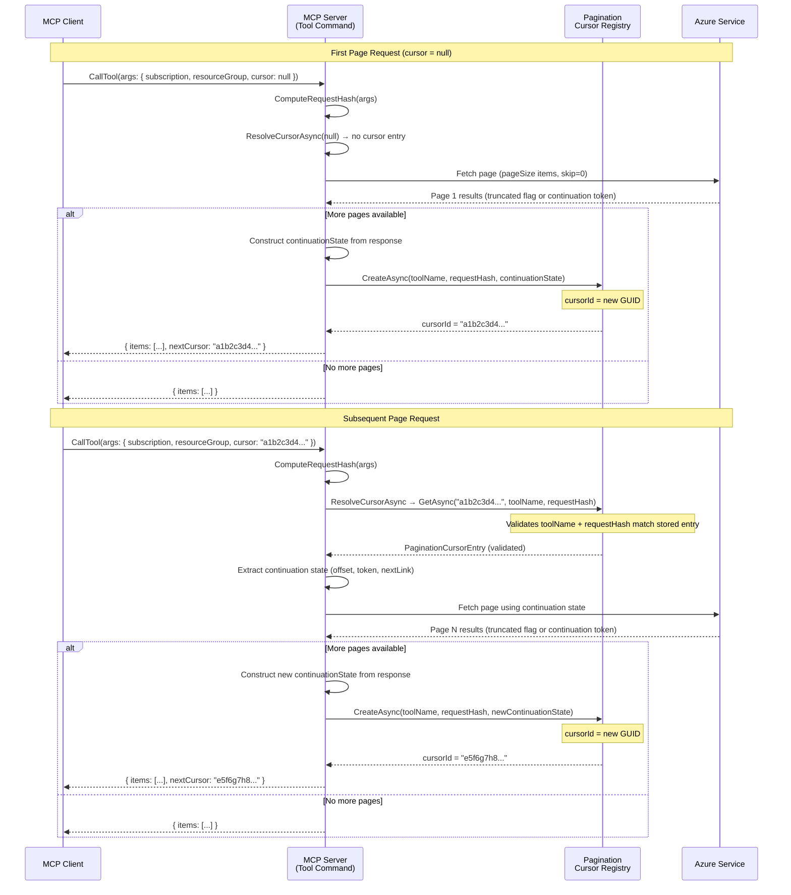
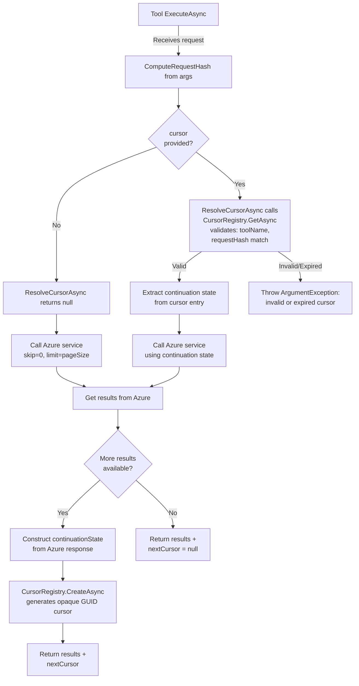
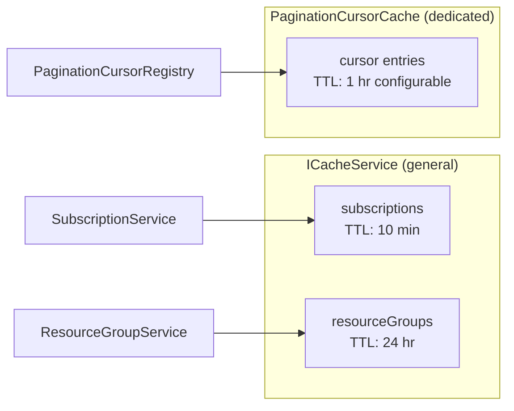

# Pagination Design for Azure MCP Tools

## Overview

This document describes the cursor-based pagination framework for Azure MCP tools that return collections. The design introduces an opaque cursor mechanism that works across all backend types (Azure Resource Graph, ARM SDK, REST APIs, data-plane SDKs).

## Request / Response Schema

### Request

Every paginated tool accepts an optional `cursor` parameter alongside its existing parameters:

```json
{
  "subscription": "my-sub",
  "resourceGroup": "my-rg",
  "cursor": null
}
```

- **First page**: `cursor` is `null` or omitted
- **Subsequent pages**: `cursor` is the opaque string from the previous response's `nextCursor`

When `cursor` is provided, the server validates that the cursor was issued for the same tool and request parameters before using it.

### Response

The tool result includes a `nextCursor` field at the top level alongside the items, following the [MCP pagination specification](https://modelcontextprotocol.io/specification/2025-03-26/server/utilities/pagination):

```json
{
  "status": 200,
  "results": {
    "items": [ ... ],
    "nextCursor": "c_abc123def456"
  },
  "duration": 234
}
```

- `nextCursor`: Opaque cursor string if more results exist; omitted if this is the last page

## Interaction Sequence



## Cursor Registry Flow



## Cache Architecture



Pagination cursors are stored in a dedicated `PaginationCursorCache` backed by `ConcurrentDictionary` with absolute TTL expiration. This cache is fully independent of the general `ICacheService` used by subscription and resource group services.

## Cursor Entry Structure

Each cursor entry in the registry contains:

| Field | Type | Purpose |
|---|---|---|
| `ToolName` | `string` | Tool that created the cursor (e.g., `azmcp_acr_registry_list`) |
| `RequestHash` | `string` | SHA256 hash of request parameters (excluding `cursor`); validated on retrieval to ensure consistency |
| `ContinuationState` | `Dictionary<string, string>` | Backend-specific state (e.g., `nextLink`, `offset`, `skipToken`) |
| `CreatedAt` | `DateTimeOffset` | Timestamp for diagnostics |

The `ContinuationState` dictionary is intentionally generic to support all backend pagination mechanisms:

- **Resource Graph**: `{ "offset": "50" }` (KQL skip-based)
- **ARM SDK**: `{ "continuationToken": "..." }` (from `AsPages()`)
- **REST API**: `{ "nextLink": "https://..." }` (URL for next page)
- **Marketplace**: `{ "skipToken": "..." }` (OData `$skiptoken`)

## Tool Metadata

Paginated tools set `SupportsPagination = true` in their `ToolMetadata`:

```csharp
public override ToolMetadata Metadata => new()
{
    Destructive = false,
    ReadOnly = true,
    SupportsPagination = true
};
```

This is surfaced to MCP clients as a `PaginationHint` in the tool's `Meta` property.

## Tool Description Convention

Paginated tools append the following guidance to their description:

> Returns up to {pageSize} items per request. If `nextCursor` is non-null in the response, more results are available. To fetch the next page, call this tool again with the same parameters and pass the returned `nextCursor` value as the `cursor` parameter. Always confirm with the user before fetching additional pages.

## Configuration

Pagination behavior is configured via `PaginationOptions`:

| Setting | Default | Description |
|---|---|---|
| `DefaultPageSize` | 50 | Number of items per page when tool doesn't specify its own |
| `CursorTimeToLive` | 1 hour | How long a cursor remains valid in cache |

## Security Considerations

- **Request hash validation**: On each cursor use, the server verifies the request parameters match the original request (excluding `cursor`), preventing parameter manipulation
- **TTL expiry**: Cursors automatically expire after the configured TTL, preventing stale data access
- **Opaque IDs**: Cursor IDs are opaque GUIDs that reveal no information about internal state
