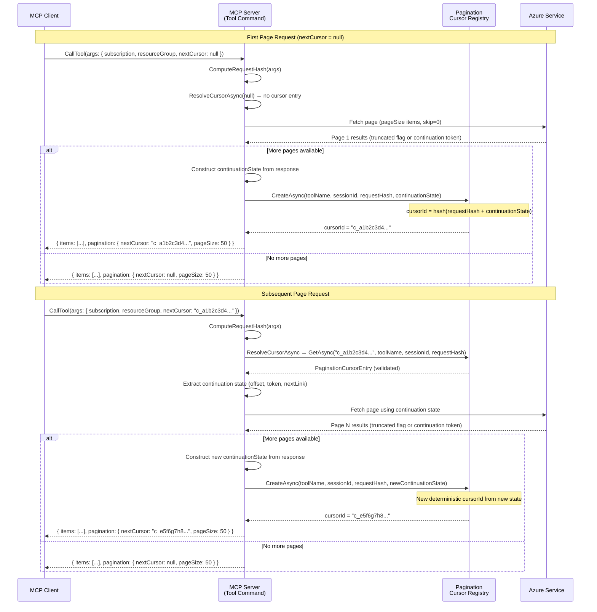
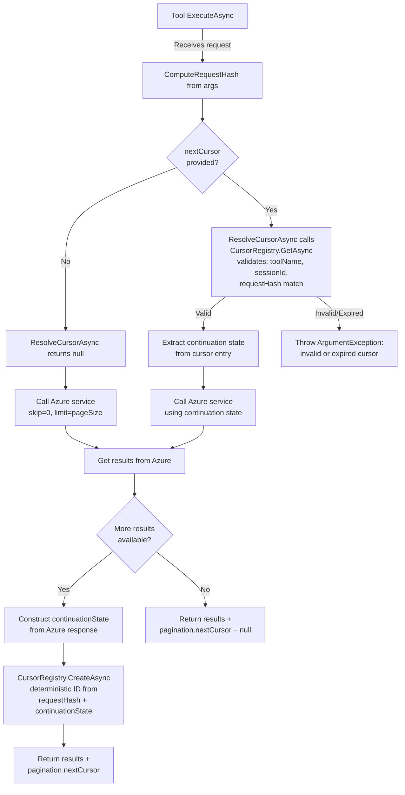
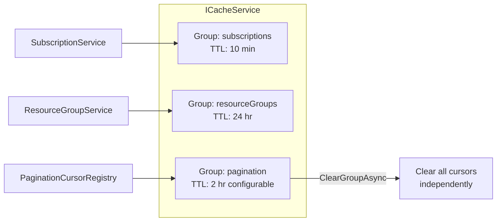

# Pagination Design for Azure MCP Tools

## Overview

This document describes the cursor-based pagination framework for Azure MCP tools that return collections. The design introduces an opaque, session-scoped cursor mechanism that works across all backend types (Azure Resource Graph, ARM SDK, REST APIs, data-plane SDKs).

## Request / Response Schema

### Request

Every paginated tool accepts an optional `nextCursor` parameter alongside its existing parameters:

```json
{
  "subscription": "my-sub",
  "resourceGroup": "my-rg",
  "nextCursor": null
}
```

- **First page**: `nextCursor` is `null` or omitted
- **Subsequent pages**: `nextCursor` is the opaque string returned from the previous response

When `nextCursor` is provided, the server validates that the cursor was issued for the same tool, session, and request parameters before using it.

### Response

The tool result includes a `pagination` section:

```json
{
  "status": 200,
  "results": {
    "items": [ ... ],
    "pagination": {
      "nextCursor": "c_abc123def456",
      "pageSize": 50
    }
  },
  "duration": 234
}
```

- `pagination.nextCursor`: Opaque cursor string if more results exist; `null` if this is the last page
- `pagination.pageSize`: Number of items requested per page

## Interaction Sequence



## Cursor Registry Flow



## Cache Architecture



The pagination cache group is fully isolated from other cache groups. Calling `ClearGroupAsync("pagination")` removes all cursors without affecting subscription or resource group caches.

## Cursor Entry Structure

Each cursor entry in the registry contains:

| Field | Type | Purpose |
|---|---|---|
| `ToolName` | `string` | Tool that created the cursor (e.g., `azmcp_acr_registry_list`) |
| `SessionId` | `string` | User/session scope for multi-user security |
| `RequestHash` | `string` | SHA256 hash of request parameters (excluding `nextCursor`) to validate consistency |
| `ContinuationState` | `Dictionary<string, string>` | Backend-specific state (e.g., `nextLink`, `offset`, `skipToken`) |
| `CreatedAt` | `DateTimeOffset` | Timestamp for diagnostics |

The `ContinuationState` dictionary is intentionally generic to support all backend pagination mechanisms:

- **Resource Graph**: `{ "offset": "50" }` (KQL skip-based)
- **ARM SDK**: `{ "continuationToken": "..." }` (from `AsPages()`)
- **REST API**: `{ "nextLink": "https://..." }` (URL for next page)
- **Marketplace**: `{ "skipToken": "..." }` (OData `$skiptoken`)

## Tool Metadata

Paginated tools set `SupportsPagination = true` in their `ToolMetadata`:

```csharp
public override ToolMetadata Metadata => new()
{
    Destructive = false,
    ReadOnly = true,
    SupportsPagination = true
};
```

This is surfaced to MCP clients as a `PaginationHint` in the tool's `Meta` property.

## Tool Description Convention

Paginated tools append the following guidance to their description:

> Returns up to {pageSize} items per request. If `pagination.nextCursor` is non-null in the response, more results are available. To fetch the next page, call this tool again with the same parameters and the returned `nextCursor` value. Always confirm with the user before fetching additional pages.

## Configuration

Pagination behavior is configured via `PaginationOptions`:

| Setting | Default | Description |
|---|---|---|
| `DefaultPageSize` | 50 | Number of items per page when tool doesn't specify its own |
| `CursorTimeToLive` | 2 hours | How long a cursor remains valid in cache |

## Security Considerations

- **Session scoping**: Cursors are scoped to a session/user identity, preventing cross-user cursor reuse in HTTP mode
- **Request hash validation**: On each cursor use, the server verifies the request parameters match the original request (excluding `nextCursor`), preventing parameter manipulation
- **TTL expiry**: Cursors automatically expire after the configured TTL, preventing stale data access
- **Opaque IDs**: Cursor IDs are opaque GUIDs that reveal no information about internal state
